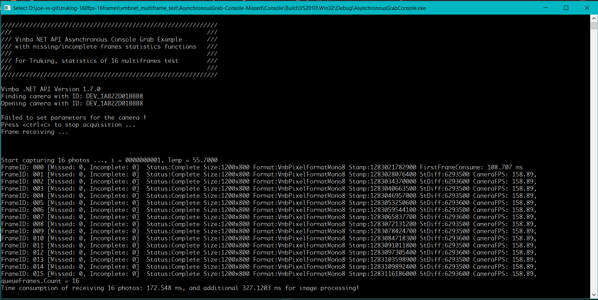

Vimba .NET 图像采集状态统计例程 - vmbnet_freerun_missing_frames_statistics
---

# 简介

VimbaNET_Examples\AsynchronousGrab-Console Example with missing/incomplete frames counting functions.  
基于VimbaNET_Examples\AsynchronousGrab-Console例程，增加图像接收统计功能。  
通过每张图片的连续递增序号以及每张图片的状态值来判断丢失或者不完整的图片数量。  

每次取图16张。 


# 相机参数设置
在相机缺省参数基础上，需要设置如下参数
* `AcquisitionMode`: `MultiFrame`
* `AcquisitionFrameCount`: `16`


# Visual Studio 设置
此程序使用了`OpenCvSharp`组件。
可以使用Visual Studio 2017或者更高版本，从NuGet中安装 `OpenCvSharp` 组件。
https://github.com/shimat/opencvsharp  
使用方法：https://blog.csdn.net/bayinglong/article/details/84258687


# 例程使用说明


* FrameID: 自从相机上电运行后，每一张图片都具有一个连续递增的序列号。
* Missed: 已经累积丢失的图片数量。
* Incomplete: 已经累积收到的不完整图片数量。  
        例如，下面是主要的采图失败状态码：  
        `VmbFrameStatusFault = -4,`  
        `VmbFrameStatusInvalid = -3,`   
        `VmbFrameStatusTooSmall = -2,`    
        `VmbFrameStatusIncomplete = -1,`  
        `VmbFrameStatusComplete = 0`  
* Stamp: 相机拍摄图片时的时间戳，也就是相机感光芯片直接成像的时刻。
* StDiff: 与前一张图片时间戳的差。


# 代码及编译  
## 基于下面代码
在这里：https://github.com/avtcn/vmbnet_freerun_missing_frames_statistics
## 编译运行
可以使用[Visual Studio 2010](https://visualstudio.microsoft.com/) 或者更高版本，Vimba SDK 建议使用 [2.1.3或者更高版本](https://www.alliedvision.com/en/products/software.html)。

## 运行结果

*truking-log.csv*

```
index, 0000000001, temp, 55.500, fisrtframe, 107.711, 16frames_time, 180.517, imgproc_time, 263.296, 
index, 0000000002, temp, 55.500, fisrtframe, 32.912, 16frames_time, 127.667, imgproc_time, 64.827, 
index, 0000000003, temp, 55.500, fisrtframe, 31.364, 16frames_time, 126.147, imgproc_time, 56.830, 
index, 0000000004, temp, 55.500, fisrtframe, 30.615, 16frames_time, 125.353, imgproc_time, 78.789, 
index, 0000000005, temp, 55.500, fisrtframe, 32.845, 16frames_time, 125.441, imgproc_time, 64.847, 
index, 0000000006, temp, 55.500, fisrtframe, 34.991, 16frames_time, 130.946, imgproc_time, 59.839, 
index, 0000000007, temp, 55.500, fisrtframe, 30.894, 16frames_time, 127.670, imgproc_time, 69.813, 
index, 0000000008, temp, 55.500, fisrtframe, 32.649, 16frames_time, 127.608, imgproc_time, 60.862, 
index, 0000000009, temp, 55.500, fisrtframe, 36.219, 16frames_time, 130.071, imgproc_time, 56.872, 
index, 0000000010, temp, 55.500, fisrtframe, 32.912, 16frames_time, 127.658, imgproc_time, 78.789, 
index, 0000000011, temp, 55.500, fisrtframe, 31.916, 16frames_time, 128.682, imgproc_time, 59.858, 
index, 0000000012, temp, 55.500, fisrtframe, 32.912, 16frames_time, 126.663, imgproc_time, 77.792, 
index, 0000000013, temp, 55.500, fisrtframe, 31.915, 16frames_time, 126.662, imgproc_time, 69.812, 
index, 0000000014, temp, 55.500, fisrtframe, 31.304, 16frames_time, 125.210, imgproc_time, 60.861, 
index, 0000000015, temp, 55.500, fisrtframe, 33.350, 16frames_time, 129.013, imgproc_time, 63.805, 
index, 0000000016, temp, 55.500, fisrtframe, 31.915, 16frames_time, 126.661, imgproc_time, 73.803, 
index, 0000000017, temp, 55.500, fisrtframe, 31.297, 16frames_time, 126.119, imgproc_time, 58.844, 
index, 0000000018, temp, 55.500, fisrtframe, 34.242, 16frames_time, 131.458, imgproc_time, 56.854, 
index, 0000000019, temp, 55.500, fisrtframe, 33.175, 16frames_time, 129.744, imgproc_time, 60.851, 
index, 0000000020, temp, 55.500, fisrtframe, 30.918, 16frames_time, 124.793, imgproc_time, 56.848, 
index, 0000000021, temp, 55.500, fisrtframe, 31.842, 16frames_time, 127.427, imgproc_time, 75.785, 
index, 0000000022, temp, 55.500, fisrtframe, 31.914, 16frames_time, 125.773, imgproc_time, 70.810, 
index, 0000000023, temp, 55.500, fisrtframe, 30.278, 16frames_time, 126.283, imgproc_time, 62.781, 
index, 0000000024, temp, 55.500, fisrtframe, 31.897, 16frames_time, 127.922, imgproc_time, 52.860, 
index, 0000000025, temp, 55.500, fisrtframe, 30.917, 16frames_time, 125.552, imgproc_time, 53.874, 
index, 0000000026, temp, 55.500, fisrtframe, 34.923, 16frames_time, 129.238, imgproc_time, 49.894, 
index, 0000000027, temp, 55.500, fisrtframe, 31.913, 16frames_time, 126.259, imgproc_time, 58.841, 
index, 0000000028, temp, 55.500, fisrtframe, 30.926, 16frames_time, 124.650, imgproc_time, 58.807, 
index, 0000000029, temp, 55.500, fisrtframe, 35.730, 16frames_time, 128.630, imgproc_time, 50.864, 
index, 0000000030, temp, 55.500, fisrtframe, 36.513, 16frames_time, 131.047, imgproc_time, 45.873, 
index, 0000000031, temp, 55.500, fisrtframe, 33.098, 16frames_time, 128.413, imgproc_time, 55.873, 
index, 0000000032, temp, 55.500, fisrtframe, 33.992, 16frames_time, 129.680, imgproc_time, 54.855, 
index, 0000000033, temp, 55.500, fisrtframe, 32.912, 16frames_time, 126.662, imgproc_time, 58.843, 
index, 0000000034, temp, 55.700, fisrtframe, 32.912, 16frames_time, 126.661, imgproc_time, 64.826, 
index, 0000000035, temp, 55.700, fisrtframe, 34.922, 16frames_time, 129.372, imgproc_time, 56.847, 
index, 0000000036, temp, 55.700, fisrtframe, 30.918, 16frames_time, 125.664, imgproc_time, 65.823, 
index, 0000000037, temp, 55.700, fisrtframe, 32.912, 16frames_time, 126.736, imgproc_time, 47.871, 
index, 0000000038, temp, 55.700, fisrtframe, 33.970, 16frames_time, 126.550, imgproc_time, 70.808, 
index, 0000000039, temp, 55.700, fisrtframe, 33.910, 16frames_time, 128.658, imgproc_time, 70.810, 
index, 0000000040, temp, 55.700, fisrtframe, 30.917, 16frames_time, 124.666, imgproc_time, 63.830, 
index, 0000000041, temp, 55.700, fisrtframe, 34.436, 16frames_time, 130.273, imgproc_time, 49.863, 
index, 0000000042, temp, 55.700, fisrtframe, 34.835, 16frames_time, 130.964, imgproc_time, 49.856, 
index, 0000000043, temp, 55.700, fisrtframe, 36.231, 16frames_time, 129.147, imgproc_time, 54.876, 
index, 0000000044, temp, 55.700, fisrtframe, 33.911, 16frames_time, 126.657, imgproc_time, 49.866, 
index, 0000000045, temp, 55.700, fisrtframe, 34.985, 16frames_time, 134.896, imgproc_time, 67.822, 
index, 0000000046, temp, 55.700, fisrtframe, 33.404, 16frames_time, 127.812, imgproc_time, 53.855, 
index, 0000000047, temp, 55.700, fisrtframe, 36.410, 16frames_time, 129.076, imgproc_time, 53.856, 
index, 0000000048, temp, 55.700, fisrtframe, 34.227, 16frames_time, 127.439, imgproc_time, 49.891, 
index, 0000000049, temp, 55.700, fisrtframe, 35.118, 16frames_time, 127.952, imgproc_time, 50.949, 
index, 0000000050, temp, 55.700, fisrtframe, 34.796, 16frames_time, 127.942, imgproc_time, 59.865, 


```


